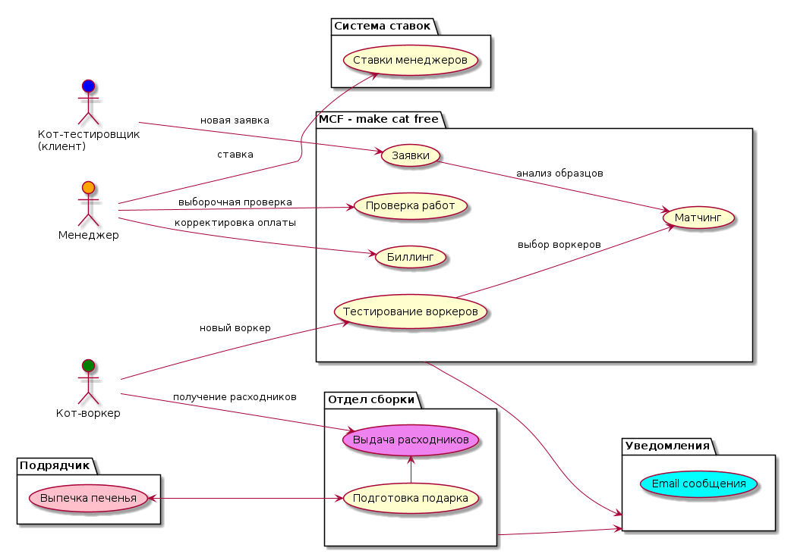
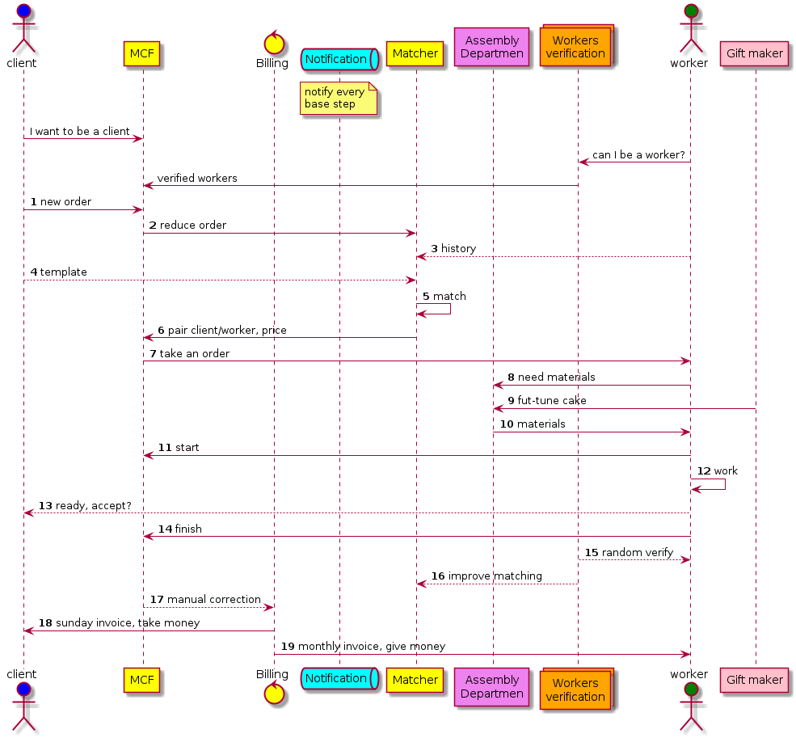

# Общее описание системы

Описание системы по первым вводным данным и требованиям.

Укрупненно схему основных участников и процессов можно представить так

## Описание

С учетом условия сокращения времени выхода на рынок лучше использовать готовые, наиболее подходящие решения:

1. Интерфейс и админка на базе [Django](https://www.djangoproject.com/)
2. Основна база данных для хранения заявок и их статусов - [PostgreSQL](https://www.postgresql.org/) или [MySQL](https://www.mysql.com/)
3. Для уведомлений напрашивается отдельный микросервис, возможно даже с какой-то системой очередей. Но в первом варианте можно использовать туже реляционную базу данных со статусами записей "отправлено" / "не отправлено" и отдельным процессом, который будет периодически проверять статусы и отправлять emails.
4. Подбор воркеров тоже может оказаться затратным и придется его вынести отдельно. Тут будут нужны уточнения и проверки на практике.
5. А "Отдел сборки" наоборот, хоть и изображен отдельно, но вполне может быть частью основного приложения, работающей через APIs вызовы "Матчинга" и "Подрядчика".
6. То же самое со ставками менеджеров. Нужен простой интерфейс для ввода и просмотра данных, а сама логика не выглядит тяжелой. Сначала можно сделать без выделения отдельного сервиса как часть "Биллинга".
7. "Биллинг" для создания счетов сначала проще сделать django командой, запускаемой по расписанию.

Последовательность действий может быть такой:

