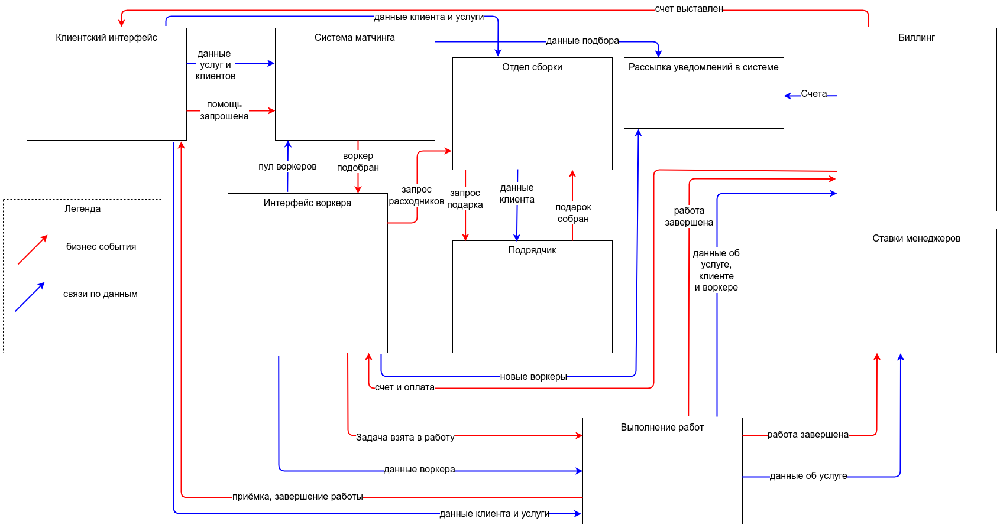

# Домашнее задание урока №1

## Event storming модель проекта

- [PDF](./es.pdf)
- [JPEG](./es.jpg)

Логика группировки

1. Административный интерфейс
   - менеджеры добавляют типы услуг
   - есть возможность управлять клиентами
   - кабинет клиента - можно описать услугу и запросить "помощь"
2. Интерфейс воркера
   - регистрация воркеров
   - выбор тестов для них
   - проверка результатов тестирования
   - приём заявки после подбора или отказ
3. Система матчинга - магический сервис, который подбирает воркера
4. Отдел сборки - подготовка расходников и подарков под услугу
5. Подрядчик - печет подарочные fur-tune печенья, используя данные о клиенте и услуге
6. Рассылка уведомлений - сервис для отправки уведомлений о различных событиях
7. Выполнение работ - основной процесс оказания услуги и его верификации
8. Биллинг - выставление счетов и их оплата
9. Ставки менеджеров - дополнительный сервис для управления ставками менеджеров для увеличения их мотивации

## Модель данных

Потоковые коммуникации используются только для уведомлений и системы матчинга. Остальные по требованию акторов или с запуском по времени (создание счетов).

Вариант в [PDF](./data_model.pdf).

## Общая модель коммуникаций

Вариант в [PDF](./contex_view.pdf).

## Выбор реализации

Из общих пожеланий к системе:

- низкий TTM (time to market)
- пока низкая нагрузка (десятки сущностей)
- критично быстро проверять гипотезы

Условие | Микросервисы | Монолит
--- | --- | ---
Низкий TTM | Для каждого сервиса отдельно да, но для всех суммарно - нет. | Предсказуемый, можно делать достаточно быстро.
Низкая нагрузка | Легко выдержим, даже с большим запасом. | Тут можно выиграть, пока не думая о масштабировании.
Быстро проверять гипотезы | Отлично, можно быстро проверять отдельные сервисы. | Сложнее, релизы будут реже, возможно взаимозависимые изменения.

По первым 2 пунктам выигрывает монолит, по третьему - микросервисы. Поэтому предлагаю начать с **монолита**, а потом по мере роста нагрузки и сложности уже подумать о микросервисах.

## Спорные места

- Подрядчик с печеньками очень спорный момент, а сильно ли он нужен бизнесу на текущем этапе?
- Система оплаты от клиентов будет работать по пред или постоплате?
- Нужна ли обратная связь о качестве системы скидок для анализа?
